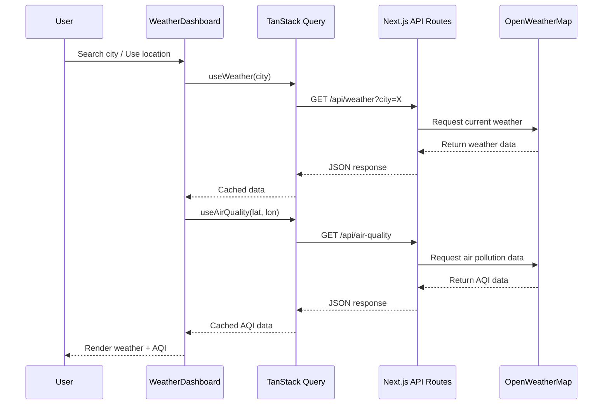
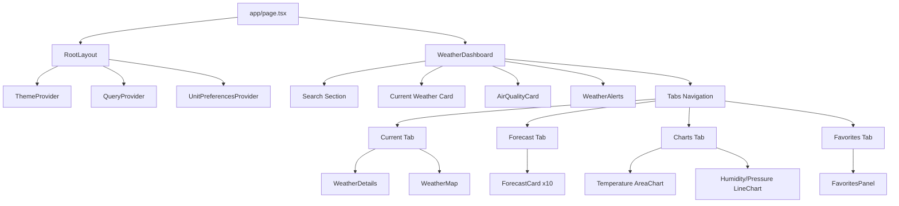

# WeatherNet - Advanced Weather Network

WeatherNet is a sophisticated, feature-rich weather network application built with Next.js 15, TypeScript, and Tailwind CSS. Experience weather data with comprehensive analytics, intelligent features, and a sleek monochrome design.


---

## License & Copyright

**© 2025 Ayush Singh. All rights reserved.**

This is proprietary software owned exclusively by Ayush Singh. No part of this software may be used, copied, modified, distributed, or otherwise utilized without explicit written permission from the copyright holder.

**UNAUTHORIZED USE IS STRICTLY PROHIBITED**

For licensing inquiries, contact: ayushsingh21109@gmail.com

---

## Features

### Core Weather Features
- **Real-time Weather Data** - Current conditions with live updates
- **5-Day Detailed Forecast** - Hour-by-hour predictions
- **Interactive Weather Charts** - Temperature, humidity, and pressure trends
- **Weather Alerts** - Intelligent warnings for extreme conditions

### Smart Features
- **Auto Location Detection** - GPS-based weather for your current location
- **Favorites System** - Save and quickly access your favorite cities
- **Air Quality Index** - Real-time pollution data with health recommendations
- **Interactive Maps** - Visual location context with map integration

### User Interface
- **Monochrome Design** - Elegant black and white aesthetic
- **Dark/Light Mode** - Seamless theme switching
- **Fully Responsive** - Optimized for mobile, tablet, and desktop
- **Glassmorphism Design** - Modern frosted glass effects
- **High Performance** - Optimized with smooth animations

### Advanced Analytics
- **Temperature Trends** - Visual charts showing weather patterns
- **Wind & Pressure Data** - Comprehensive atmospheric information
- **Precipitation Probability** - Rain forecasts with percentage chances
- **Sunrise/Sunset Times** - Complete daily light cycle information

---

## Architecture Overview

```mermaid
graph TB
    subgraph "Client Layer"
        UI[React 19 Components]
        Hooks[Custom Hooks]
        State[TanStack Query Cache]
    end

    subgraph "API Layer"
        NextAPI[Next.js API Routes]
        WeatherAPI[/api/weather]
        ForecastAPI[/api/forecast]
        AirQualityAPI[/api/air-quality]
    end

    subgraph "External Services"
        OWM[OpenWeatherMap API]
        Geo[Browser Geolocation]
    end

    UI --> Hooks
    Hooks --> State
    State --> NextAPI
    NextAPI --> WeatherAPI
    NextAPI --> ForecastAPI
    NextAPI --> AirQualityAPI
    WeatherAPI --> OWM
    ForecastAPI --> OWM
    AirQualityAPI --> OWM
    Hooks --> Geo
```

---

## Data Flow



---

## Component Structure



---

## Tech Stack

### Frontend
- **Next.js 15** - React framework with App Router
- **React 19** - Latest React with concurrent features
- **TypeScript** - Type-safe development
- **Tailwind CSS** - Utility-first styling
- **Shadcn/ui** - Accessible component primitives
- **Recharts** - Interactive data visualization
- **TanStack Query** - Server state management & caching

### APIs & Services
- **OpenWeatherMap API** - Weather and air quality data
- **Geolocation API** - Browser-based location detection

### Development Tools
- **ESLint** - Code quality
- **TypeScript Strict Mode** - Enhanced type safety
- **Vitest** - Unit testing
- **GitHub Actions** - CI/CD pipeline

---

## Installation & Setup

**IMPORTANT: This software is proprietary and requires permission from Ayush Singh before use.**

### Prerequisites
- Node.js 18+
- OpenWeatherMap API key (free at [openweathermap.org](https://openweathermap.org/api))
- Written permission from Ayush Singh

### Quick Start (Authorized Users Only)

1. **Obtain Permission:**
   Contact ayushsingh21109@gmail.com for licensing

2. **Clone the repository:**
   ```bash
   git clone https://github.com/AyushSingh360/weathernet.git
   cd weathernet
   ```

3. **Install dependencies:**
   ```bash
   pnpm install
   ```

4. **Configure Environment Variables:**
   
   Create `.env.local` in the project root:
   ```env
   OPENWEATHERMAP_API_KEY=your_api_key_here
   ```

5. **Run the development server:**
   ```bash
   pnpm dev
   ```

   Open [http://localhost:3000](http://localhost:3000)

---

## Available Scripts

| Command | Description |
|---------|-------------|
| `pnpm dev` | Start development server |
| `pnpm build` | Build for production |
| `pnpm start` | Start production server |
| `pnpm lint` | Run ESLint |
| `pnpm typecheck` | Run TypeScript compiler check |
| `pnpm test` | Run Vitest unit tests |
| `pnpm test:watch` | Run tests in watch mode |

---

## Usage Guide

### Search for Cities
- Type any city name in the search bar
- Get instant weather updates with smooth animations

### Use Your Location
- Click the location button to auto-detect your position
- Grant location permissions for the best experience

### Manage Favorites
- Click the bookmark icon to save cities
- Access your favorites from the dedicated tab
- Remove cities with a single click

### Explore Data
- Switch between Current, Forecast, Charts, and Favorites tabs
- Hover over elements for interactive details
- View comprehensive weather metrics

---

## Project Structure

```
weathernet/
├── app/                    # Next.js App Router
│   ├── api/               # API routes
│   │   ├── weather/       # Current weather endpoint
│   │   ├── forecast/      # Forecast endpoint
│   │   └── air-quality/   # Air quality endpoint
│   ├── globals.css        # Global styles & animations
│   ├── layout.tsx         # Root layout
│   └── page.tsx          # Home page
├── components/            # React components
│   ├── ui/               # Reusable UI components (Shadcn)
│   ├── logo.tsx          # WeatherNet logo component
│   ├── weather-dashboard.tsx  # Main dashboard
│   ├── weather-chart.tsx     # Chart components
│   ├── air-quality-card.tsx  # Air quality display
│   ├── skeletons.tsx         # Loading skeletons
│   ├── error-boundary.tsx    # Error boundary
│   └── ...               # Other feature components
├── hooks/                # Custom React hooks
│   ├── use-weather.tsx   # Weather data management
│   ├── use-air-quality.tsx   # Air quality data
│   ├── use-geolocation.tsx   # Location detection
│   ├── use-favorites.tsx     # Favorites management
│   └── use-unit-preferences.tsx # Unit conversion system
├── lib/                  # Utility functions
├── providers/            # Context providers
│   └── query-provider.tsx    # TanStack Query provider
├── types/                # TypeScript definitions
├── public/               # Static assets
└── vitest.config.ts      # Vitest configuration
```

---

## Design Philosophy

### Visual Design
- **Monochrome Aesthetic** - Sophisticated black and white color scheme
- **Glassmorphism** - Frosted glass effects with backdrop blur
- **Micro-interactions** - Subtle animations enhancing user experience
- **Typography Hierarchy** - Clear information architecture

### User Experience
- **Progressive Disclosure** - Information revealed contextually
- **Accessibility First** - WCAG compliant design
- **Performance Optimized** - Fast loading with smooth animations
- **Mobile Responsive** - Touch-friendly interface

---

## Key Features Explained

### Advanced Animations
```css
/* Custom keyframe animations */
@keyframes slide-up {
  from { opacity: 0; transform: translateY(20px); }
  to { opacity: 1; transform: translateY(0); }
}

/* Staggered animation delays */
.animate-slide-up.delay-100 { animation-delay: 100ms; }
```

### Air Quality Integration
- Real-time AQI (Air Quality Index) data
- PM2.5, PM10, O₃, NO₂ measurements
- Health recommendations based on pollution levels
- Monochrome color-coded quality indicators

### Interactive Charts
- Temperature trend visualization (Area Chart)
- Humidity and pressure correlations (Line Chart)
- Responsive chart design with monochrome scheme
- Smooth data transitions

### Performance Optimizations
- TanStack Query caching (5 min stale time)
- Lazy loading of heavy components
- Optimized API calls with deduplication
- Efficient state management

---

## Customization

**Note: Customization requires permission from Ayush Singh**

### Themes
Modify `app/globals.css` to customize the monochrome theme:
```css
:root {
  --primary-gradient: linear-gradient(135deg, #000000 0%, #404040 100%);
  --animation-duration: 0.6s;
}
```

### Logo Customization
The WeatherNet logo combines a cloud icon with a lightning bolt and can be customized in `components/logo.tsx`:
- Adjust icon sizes for different breakpoints
- Modify the color scheme
- Change the typography

---

## Deployment

**Deployment requires explicit permission from Ayush Singh**

### Authorized Deployment Options
1. Contact ayush.singh.dev@example.com for deployment authorization
2. Obtain written permission for production use
3. Follow standard deployment procedures only after authorization

---

## Testing

### Unit Tests
```bash
pnpm test
```

### Test Coverage
```bash
pnpm test --coverage
```

### Test Files
- `hooks/use-unit-preferences.test.ts` - Unit conversion utilities

---

## Contributing

**This is proprietary software. Contributions are not accepted without explicit permission from Ayush Singh.**

To request permission to contribute:
1. Contact ayush.singh.dev@example.com
2. Provide detailed information about proposed contributions
3. Wait for written authorization before proceeding

---

## License

**PROPRIETARY SOFTWARE - ALL RIGHTS RESERVED**

Copyright (c) 2025 Ayush Singh. All rights reserved.

This software is protected by copyright law. Unauthorized use, reproduction, or distribution is strictly prohibited and may result in severe civil and criminal penalties.

See the [LICENSE](LICENSE) file for complete terms and conditions.

---

## Acknowledgments

- **OpenWeatherMap** for comprehensive weather data
- **Shadcn/ui** for beautiful component primitives
- **Recharts** for powerful data visualization
- **TanStack Query** for server state management
- **Pexels** for stunning stock photography
- **Lucide** for crisp, consistent icons

---

## Contact & Support

**For all inquiries regarding this proprietary software:**

**Ayush Singh**
- **Email**: ayushsingh21109@gmail.com
- **Licensing**: ayushsingh21109@gmail.com
- **Authorized Bug Reports**: Contact via email only
- **Feature Requests**: Authorized users only

---

## Legal Notice

This software is the exclusive intellectual property of Ayush Singh. Any unauthorized use, copying, modification, distribution, or reverse engineering is strictly prohibited and will be prosecuted to the full extent of the law.

**© 2025 Ayush Singh. All rights reserved.**

---

<div align="center">

**WeatherNet - Proprietary Weather Network Software**

*Developed exclusively by Ayush Singh (GitHub: AyushSingh360)*

**All rights reserved. Unauthorized use prohibited.**

</div>